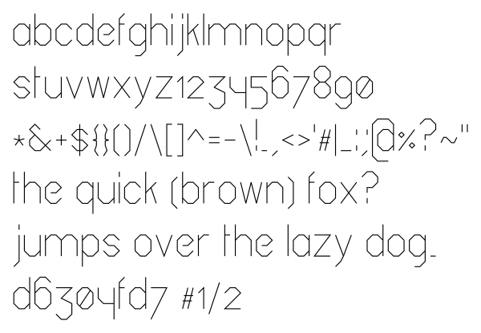
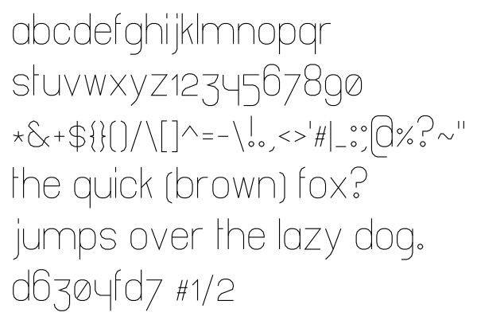

# Gridfont - Grid-based Font System

`original`

`smooth`

grid-based system for designing simple symbols and fonts. including an example
font. Mainly intended for plotter drawings.

The symbol descriptions look like this:

    S4,9:DS6|S3DtRqS2eLp

You can use spaces to separate moves, so you can for instance write it like this:

    S4,9: DS6| S3 DtRq S2 eLp

The first section (left of `:`) is the `info` section. Which currently contains
the size of the grid (as `integers`). Here the width is `4` and the height is
`9`. That is, there are `4` and `9` grid points in the two directions. That
means the width of the symbol will be `3` and `8`.

In time this section might contain other things. Such as a translate command.
(this might be useful if you are only drawing within a certain section of the
grid.)

The next section is one or more paths, separated by the pipe symbol `|`.
Specifically, the above example should result in the two paths of the letter
`b`:

    |   <-- p1
    |
    |/-\   <-- p2
    |   |
    |   |
    |\-/

Here are a few examples of more complex symbol definitions:

    asterisk: S3,9:M1,3DS|S3.75Dq1,0.25t1,0.25|M0.25,5Dt0.75,1q0.75,1
    w:        S5,9:S2D q1,4 t1,4 q1,4 t1,4
    y:        S4,9:S2Dq1.5,4|M3,2De1.5,4e0.5,1e

## Paths

When drawing a new path the cursor is always reset to the `origin`, which is in
the upper left corner. The coordinate system is rotated like this:

        -
        |
    - --o-- x+
        |
        y+

From there you can perform relative and absolute moves. Once the command `D` is
entered the path will start being drawn. Which means you can move the cursor
into position before starting each path.

### Relative Moves

The following commands are allowed:

     p   N   t
       \ | /
     L - o - R    <-- o is the current position of the cursor
       / | \
     e   S   q

Any number (see below) after a direction command is interpreted as the length
of the step, otherwise the step size is `1`. You can also use two numbers
separated by a comma. For instance `q2.5,3` will move the cursor two and a half
steps to the right, and three steps down. Similarly `p2,1/2` will move the
cursor two steps left, and half a step up.

### Numbers

Accepted numbers are either integers: `1`, fractions: `1/2` or decimals: `3.5`.
Note that all decimals are converted to fractions. Decimals are a convenience
that allows you to write `4.5` instead of `9/2`. However, you are better of
using `13/3` instead of `4.33...`. The latter will most likely not add up
inside the limits of the grid. You can also use multiple commands in the same
direction, if you find that easier. For instance `R4 R1/2`.

That means that if you get out of bounds errors, it is either because you are
using a decimal that does not "add up" properly inside the grid. Or simply
because the resulting number is outside the grid.

Numbers are converted to float before being exported to `json` or `svg`

### Absolute Moves

The following absolute moves are allowed

  - `Mx,y` to move to position `x,y` relative to the `origin`.
  - `Z` move to the first position of the drawn path. (defaults to `origin`)
  - `W` to move to move out to the right hand side of the drawing.
  - `w` to move to the left side of the drawing.
  - `H` to move to the top of the drawing.
  - `h` to move to the bottom of the drawing.

### Groups

You can provide substitution groups in the `groups` property of the `json`
specification. Groups names should always start with a `(` and end with a `)`.
Any `(group)` in a path definition will be replaced verbatim until there are no
more `(` or `)` left in the path specification. (Note: this means you can cause
infinite loops as well as memory leaks.)

## Fonts

The font paths are included in `dat/*/res.json`, along with SVGs for each
symbol. The raw descriptions are in `dat/*.json`.

At the moment the included fonts are:

 - `original`: blocky letters
 - `smooth`: smoother version.

## Using the Code

In order to use this library

    python3 setup.py install --user

You can then use the library from your code. see `gridfont/__init__.py` or
`gridfont/writer.py` to get an idea. More documentation **might** be added
later, if this seems useful to people.

To see other options use:

    gridfont --help

## Parsing your Own Symbol Definitions

To parse a symbol `.json` file such as `dat/font.json` run the following, to
output the results to the directory `out`

    gridfont parse font.json out [--svg]

If you include the `--svg` flag, an svg will also be created for each symbol.

## Writing

When you have a parsed symbol file (such `dat/original/res.json`), you can
write SVGs with it like this:

    gridfont write res.json tmp.svg 'my text'

## Contributing

This is a project I started because I wanted a simple "font" that would allow
me to easily draw line-based glyphs while plotting. I don't know whether I will
end up developing this much further, but I'm open to suggestions.

## Todo

 - Improve smooth numerals `2` and `3`?
 - Capital letters, at least `A-Z`
 - shift origin (in info section)?
 - simple pair kerning instructions?
 - some ligatures?

## References

 - This is very similar to the Hershey fonts:
   https://en.wikipedia.org/wiki/Hershey_fonts. Which you probably should use,
   as they have been around for some time

 - This method is also similar to drawing in Logo:
   https://en.wikipedia.org/wiki/Logo_(programming_language)

 - The path definitions are also similar to the SVG format (but simpler):
   https://en.wikipedia.org/wiki/Scalable_Vector_Graphics

 - If you find this interesting, you might also like Recursive Radical Packing
   Language: https://github.com/LingDong-/rrpl

 - Metafont (LaTeX): https://en.wikipedia.org/wiki/Metafont

 - LeonSans: https://github.com/cmiscm/leonsans

